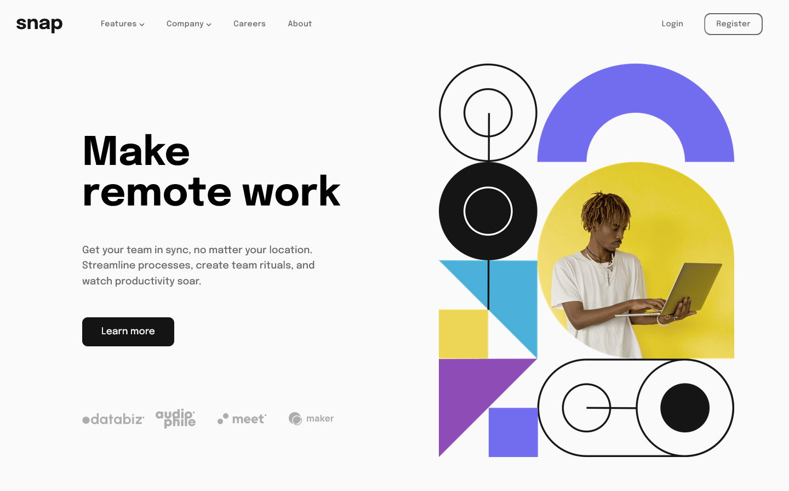
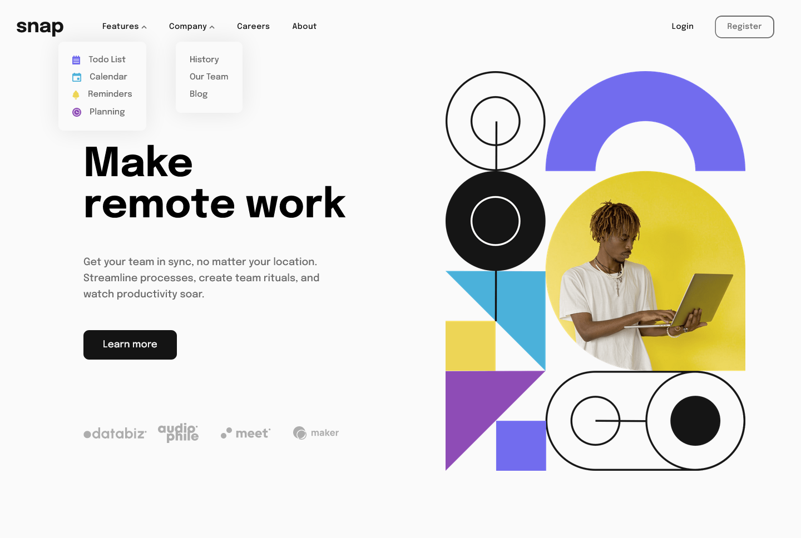
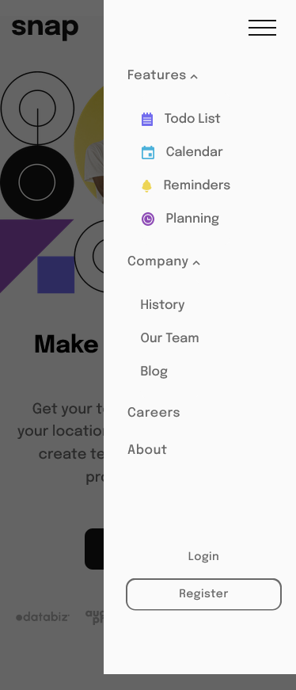

# Frontend Mentor - Intro section with dropdown navigation solution

This is a solution to the [Intro section with dropdown navigation challenge on Frontend Mentor](https://www.frontendmentor.io/challenges/intro-section-with-dropdown-navigation-ryaPetHE5). Frontend Mentor challenges help you improve your coding skills by building realistic projects.

## Table of contents

- [Frontend Mentor - Intro section with dropdown navigation solution](#frontend-mentor---intro-section-with-dropdown-navigation-solution)
  - [Table of contents](#table-of-contents)
    - [The challenge](#the-challenge)
    - [Screenshot](#screenshot)
    - [Links](#links)
  - [My process](#my-process)
    - [Built with](#built-with)
    - [What I learned](#what-i-learned)
    - [Continued development](#continued-development)
    - [Useful resources](#useful-resources)
  - [Author](#author)

### The challenge

Users should be able to:

- View the relevant dropdown menus on desktop and mobile when interacting with the navigation links
- View the optimal layout for the content depending on their device's screen size
- See hover states for all interactive elements on the page

### Screenshot

### Links

- Solution URL: [Add solution URL here](https://github.com/Nghuynh07/dropdown_navigation)
- Live Site URL: [Add live site URL here](https://your-live-site-url.com)

## My process

### Built with

- Semantic HTML5 markup
- Flexbox
- Mobile-first workflow
- SASS
- JavaScript
- Responsive

### What I learned

This was a fun and challenging project. I learned a lot about responsiveness. I tried my best to stay away from fix-sizes.

- Clamp()
- min-content / max-content / fit-content
- max-content /min-content
- min-width / max-width
- min-height
- DOM traversing

### Continued development

There are room for improvement for the project. I think the navigation can be a little more fluid. Right now, at a mobile version, the "feature" and "company" height are fixed. So when you opened it, there is a empty white space below it. I want it to expand and shrink as the user click.

### Useful resources

- [Kevin Powell](https://www.youtube.com/kepowob) - I learned a lot from Kevin regarding responsive. He has a 21 days course for responsive design, which I think is extremely helpful. Definitely recommended. His youtube channel is full of useful tip/tricks and modern CSS styling. I really enjoy learning from him.

## Author

- Website - [Huynh Nguyen](https://huynhtn.com/)
- Frontend Mentor - [@Nghuynh07](https://www.frontendmentor.io/profile/Nghuynh07)
- Twitter - [@huyniewin](https://twitter.com/huyniewin)
